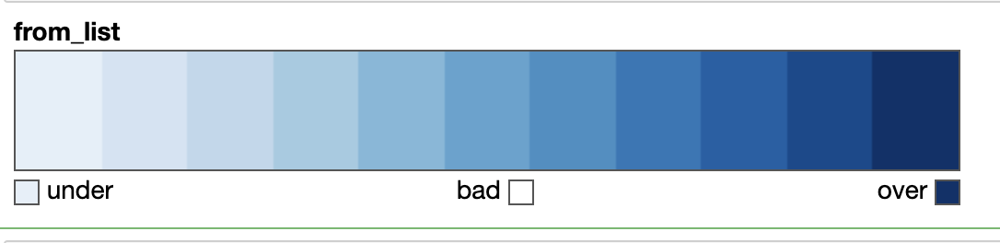
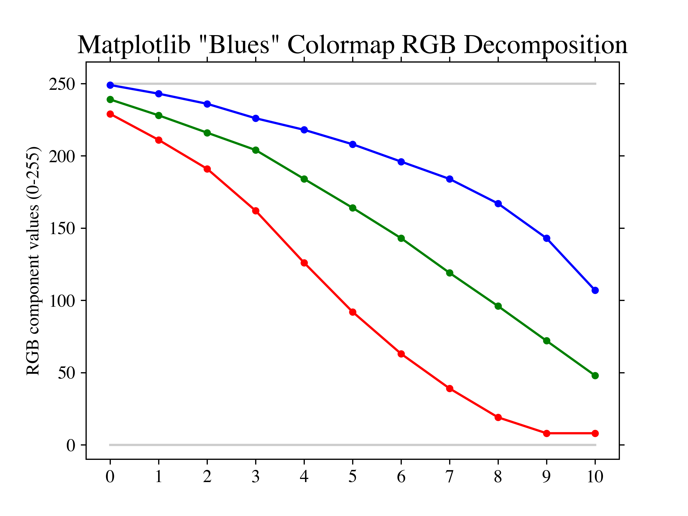
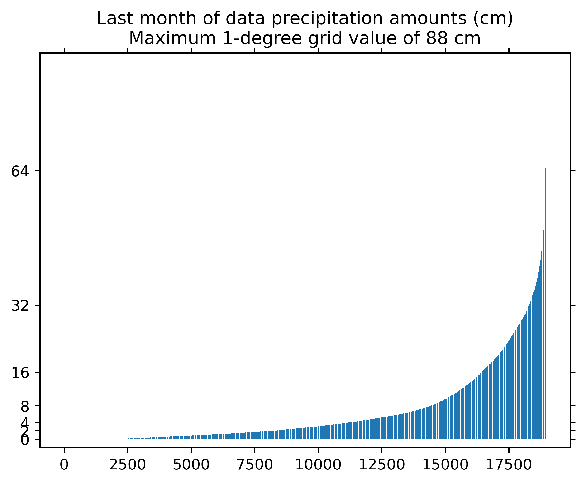
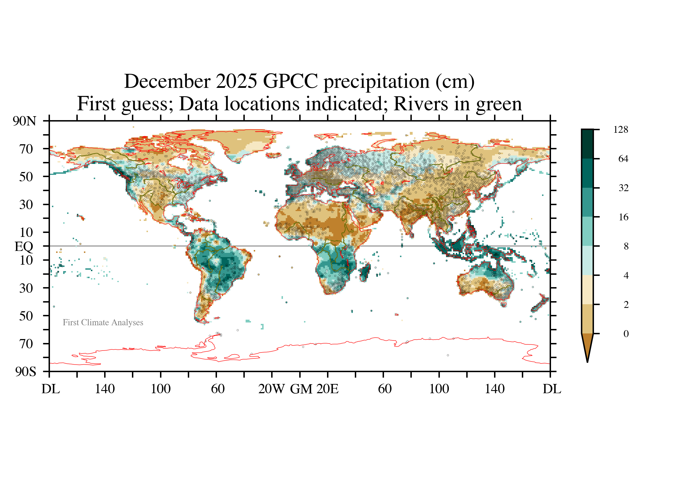

# Specifying-Colors-In-Matplotlib
## General Ideas
 
 
## General Ideas

Matplotlib has many preset colormaps (from <a href="https://matplotlib.org/stable/users/explain/colors/colormaps.html">here</a>):

 

The basic code here I got from Matplotlib documentation or StackOverflow.  My goal is to make just-the-code-one-needs available in one place.
<code><pre>from matplotlib import cm 
import matplotlib.colors as colors
newcolors = cm.get_cmap('Blues', 12)
newcolors = newcolors(np.linspace(0, 1, 12))
newcolors = newcolors[1:]
newcmp = colors.ListedColormap(newcolors)
cm.get_cmap( newcmp )</pre></code>

 

The "Blues" colormap has the following Red-Green-Blue (RGB) decomposition:

I don't like how the blue saturates at the highest values.  Matplotlib claims that "Blues" is "perceptually uniform," without providing a definition or reference.  From looking at the RGB decomposition, it seems that it would easy to get the B-values of the colormap to decrease linearly for the highest values.
 
 
Once you have found a colormap you like, you need the following code to use it in a filled contour diagram:
<code><pre>
cmap = colors.ListedColormap( newcmp.colors )
norm = colors.BoundaryNorm( contours, cmap.N )

cartopygcs = ax.contourf( xgrid2, ygrid2, sumfdat/10, cmap=cmap, levels=contours, norm=norm, transform=ccrs.PlateCarree(), zorder=0 )
In particular, "cmap=cmap, levels=contours, norm=norm" 
where 
contours = np.array( [ 0, 1, 2, 4, 8, 16, 32, 64, 128, 256, 512, 1024 ] )</pre></code>
 
The plot in this section is from the GPCC data directory, work5.ipynb, on my computer.

## Specifying Color in Precipitation Plots

I am using 1-degree latitude-longitude estimates of land precipitation from the Global Precipitation Climatology Centre for December 2025.  There are about 19000 values.

A histogram of the data using bins that are a power of 2 yields

I used colorbrewer2.org to pick the colors.

